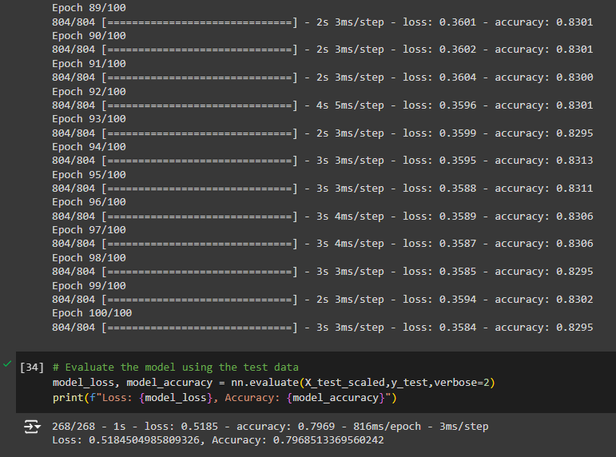

# Deep Learning Model

## Overview of the Analysis: ##
The purpose of this analysis is to develop a binary classifier using a deep learning model to predict whether applicants funded by Alphabet Soup will be successful. The goal is to effectively classify applicants based on provided features to optimize funding decisions.

## Data Preprocessing: ##

EIN and NAME — Identification columns 
APPLICATION_TYPE — Alphabet Soup application type 
AFFILIATION — Affiliated sector of industry 
CLASSIFICATION — Government organization classification 
USE_CASE — Use case for funding 
ORGANIZATION — Organization type 
STATUS — Active status 
INCOME_AMT — Income classification 
SPECIAL_CONSIDERATIONS — Special considerations for application 
ASK_AMT — Funding amount requested 
IS_SUCCESSFUL — Was the money used effectively 

### Target Variable(s): ###
The target variable for the model would be the "IS_SUCCESSFUL" column, indicating whether an applicant was successful or not.

### Feature Variable(s): ###
The feature variables would include attributes such as "APPLICATION_TYPE," "AFFILIATION," "CLASSIFICATION," etc., which are used to predict the target variable.

### Variables to Remove: ###
After a few rounds of testing, I filtered out outliers from the feature variables such as "CLASSIFICATION" and "APPLICATION_TYPE." Variables like "EIN" (Employer Identification Number) may not contribute to the prediction and were removed altogether from the input data.

## Compiling, Training, and Evaluating the Model: ##

### Neurons, Layers, and Activation Functions: ###
Specify the number of neurons and layers in the neural network model based on the complexity of the data. Choose appropriate activation functions like ReLU or Sigmoid for each layer.

### Model Performance: ###
Evaluate the model's performance in terms of accuracy, precision, and recall. Compare the results with the target performance metrics to assess the model's effectiveness.

### Steps to Improve Model Performance: ###
Experiment with hyperparameter tuning, adjusting the number of layers, neurons, or activation functions to enhance the model's predictive power.

## Summary: ##
Model was trained with 100 epochs using the Rectified Linear Unit (ReLU) function. 

  

Loss: 0.5367: The loss value is a measure of how well the model is performing. A lower loss value indicates that the model is performing better.

Accuracy: 0.7966: The accuracy value represents the proportion of correctly classified data points. An accuracy of 0.7966 means that the model is correctly predicting the target variable about 79.66% of the time.
